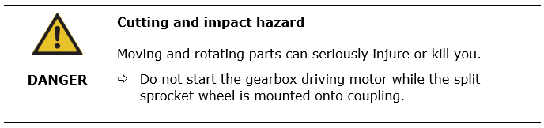

# Refusal of liability (Disclaimer)

This instruction is intended to inform the customer about the hazards resulting of split sprocket wheel use.
Presented in this instruction: split sprocket wheel, auxiliary drive, electric motor, auxiliary drive gearbox, chain and rotating parts cover, chain, driving sprocket wheel, screws are not delivered by FLSmidth MAAG Gear Sp. z o.o.

FLSmidth MAAG Gear Sp. z o.o. cannot be held liable for any use of these goods and any accidents caused by their use.

