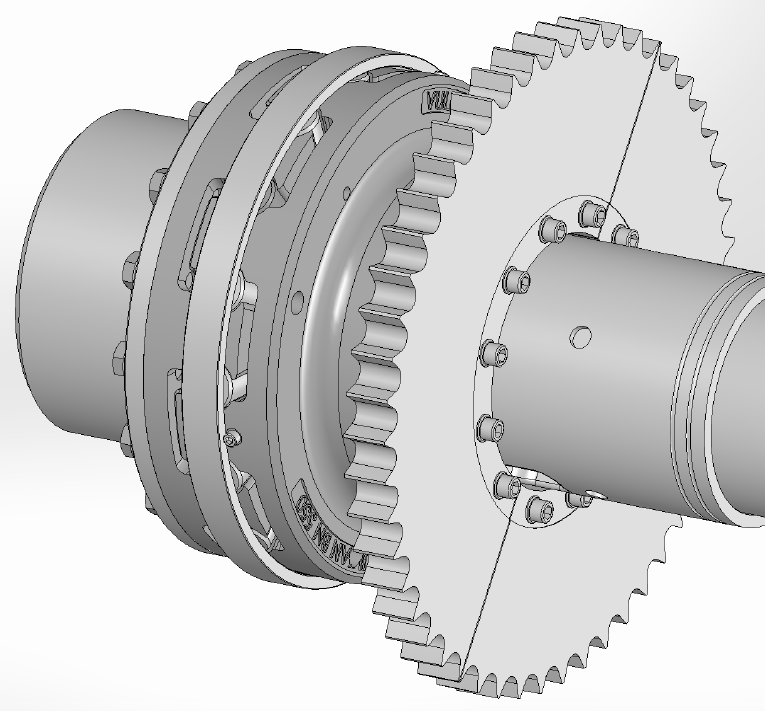

# Operating and safety instructions for split sprocket wheel supplied by customer
## For gearbox auxiliary drive

{: style="width: 300px;"}

Original operating instructions  
Issued by:	    **FLSmidth MAAG Gear Sp. z o.o., Elblag**  
Author:         **Rafal Bertolassi**   
First edition:	**August 2019 / en**  
Doc. No. 	    **60014185-en RevA**   
These operating instructions are protected by copyright. Distribution without the consent  
of FLSmidth MAAG Gear Sp. z o.o. is prohibited.
